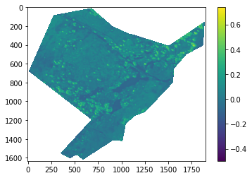
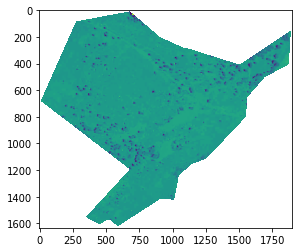

<!-- PROJECT LOGO -->
  <h3 align="center">Gaussian-Mixture-Model</h3>

 

  
   

<!-- ABOUT THE PROJECT -->
## About The Project

   
  
  

  
  
   

<!-- USAGE EXAMPLES -->
## Usage

This script can be initiated from any online notebook editor, such as jupyter lab or google colab.
From within the script, each segment can be run individually to inspect outputs. Required input files can be found in the Feature spaces folder. These .tiff files are supplied for model analysis. 

<!-- Future Work -->
## Future Work

  
<!-- LICENSE -->
## License

Distributed under the MIT License. See `LICENSE.txt` for more information.

<!-- CONTACT -->
## Contact

  
<!-- ACKNOWLEDGMENTS -->
## Acknowledgments

(<a href="#top">back to top</a>)

<!-- MARKDOWN LINKS & IMAGES -->
<!-- https://www.markdownguide.org/basic-syntax/#reference-style-links -->
[contributors-shield]: https://img.shields.io/github/contributors/othneildrew/Best-README-Template.svg?style=for-the-badge
