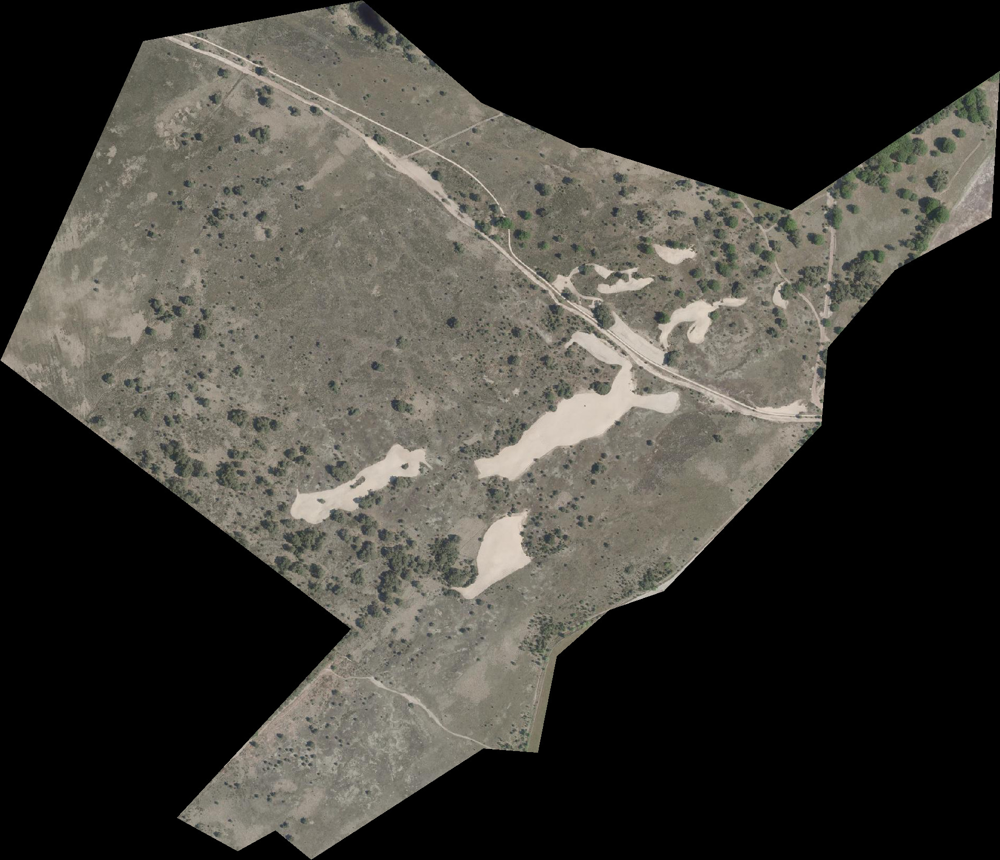
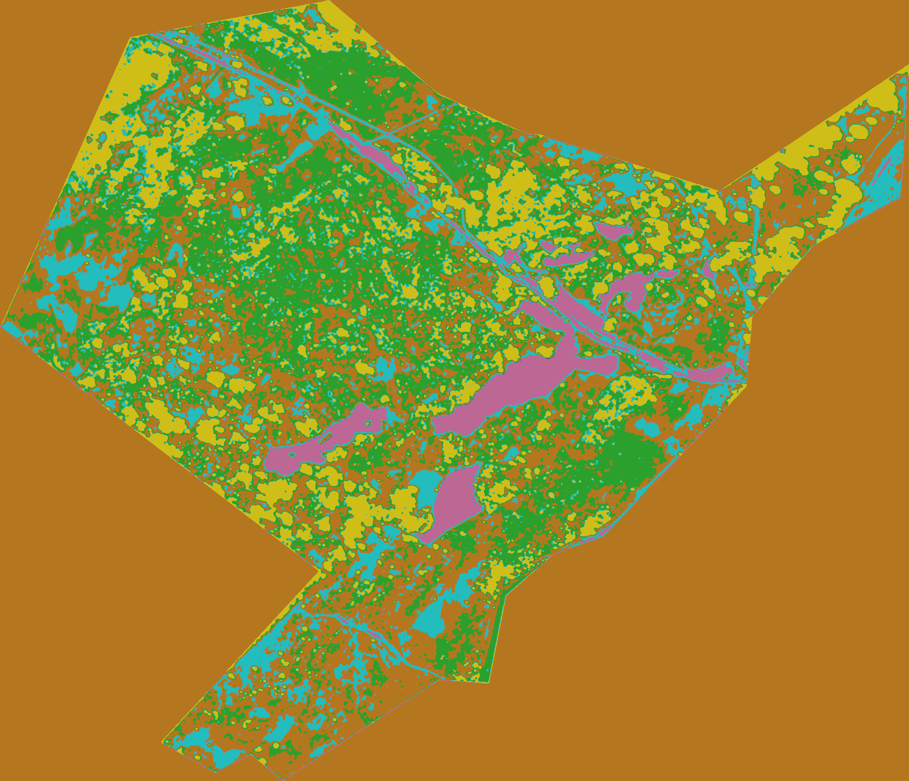

<!-- PROJECT LOGO -->

  <h3 align="center">Automated-Vegetation-Mapping-using-Unsupervised-Image-Segmentation-and-Gaussian-Mixture-model</h3>

 

  
   

<!-- ABOUT THE PROJECT -->
## About The Project
  
   
  

 
Manually identifying and mapping plant species distributions is time-consuming and consequently expensive task. Besides, to be able to map changes in vegetation, the identification needs to be repeated in time. Automated detection of plant species using remote sensing data can facilitate the process.
Here, we present a method of comparison between unsupervised machine learning and deep learning clustering techniques. 

  
 

Our subject study area is a nature conservation area in the south of the Netherelands. Within this area, our stakeholders Ecogoggle are committed to research on behalf of Staatsbosbeheer (the Dutch state forest management). However Ecogoggle wish to create a methodology which can be used in mapping previously unseen and unvisited areas. Thus we are supporting this work with a comparison of leading clustering methods in the fields of machine learning and deep learning.

 

 

### Prerequisites

    
* [Python 3.x](https://pytorch.org/)
  
  

  
### Installation

  
  1.Install Python 3.x

<!-- USAGE EXAMPLES -->
## Usage

<!-- Future Work -->
## Future Work

  
<!-- LICENSE -->
## License

Distributed under the MIT License. See `LICENSE.txt` for more information.

<!-- CONTACT -->
## Contact

[Colm Keyes](https://www.linkedin.com/in/colm-keyes-4960a5132/) - keyesco@tcd.ie

  
<!-- ACKNOWLEDGMENTS -->
## Acknowledgments

(<a href="#top">back to top</a>)

<!-- MARKDOWN LINKS & IMAGES -->
<!-- https://www.markdownguide.org/basic-syntax/#reference-style-links -->
[contributors-shield]: https://img.shields.io/github/contributors/othneildrew/Best-README-Template.svg?style=for-the-badge
